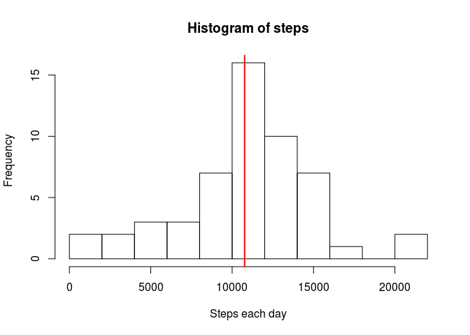
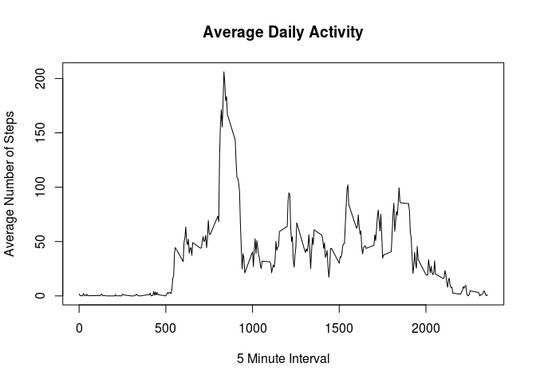
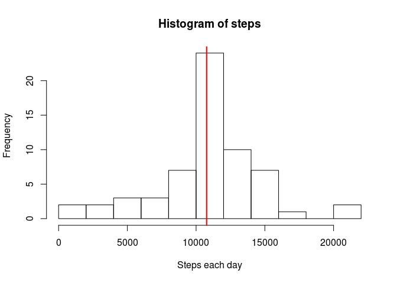
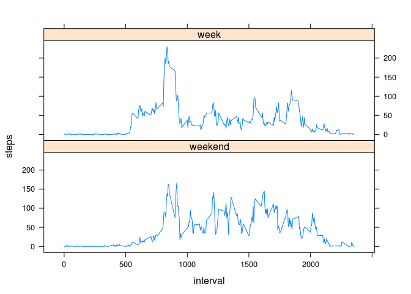

## Loading and preprocessing the data


```r
watchData <- read.csv(unz("activity.zip", "activity.csv"),na.strings="NA", sep=",", head=TRUE) 
```
#### Not consider null NA values

```r
watchData <-na.omit(watchData)
watchData$date <-  as.Date(watchData$date, "%Y-%m-%d")
```

## What is mean total number of steps taken per day?


```r
stepsEachDay<-aggregate(watchData$steps, na.rm=TRUE, 
          FUN = sum,by = list(eachday = watchData$date))
```
## The histogram with the steps of each day


```r
hist(stepsEachDay$x, breaks=10, xlab ="Steps each day", main="Histogram of steps")
abline(v = mean(stepsEachDay$x, na.rm=TRUE) , col = "red", lwd = 2)
```

<!-- -->

####We see he mean in the graph, and the value is:

```r
mean(stepsEachDay$x, na.rm=TRUE)
```

```
## [1] 10766.19
```
####And the median:

```r
median(stepsEachDay$x, na.rm=TRUE)
```

```
## [1] 10765
```

##Time series plot of the average number of steps taken

```r
library(ggplot2)
avgactivity <- aggregate(steps~interval ,watchData,mean,na.rm = TRUE)
plot(x = avgactivity$interval,y = avgactivity$steps,type = "l",
     xlab = "5 Minute Interval", ylab = "Average Number of Steps",
     main = "Average Daily Activity")
```

<!-- -->

##The 5-minute interval that, on average, contains the maximum number of steps is:


```r
avgactivity[avgactivity$steps==max(avgactivity$steps),]$interval
```

```
## [1] 835
```

## Inputing missing values

#### To count the missing values we have to charge the table again since we omited them in the previous part of the analysis

```r
watchData <- read.csv(unz("activity.zip", "activity.csv"), sep=",", head=TRUE) 
sum(is.na(watchData$steps))
```

```
## [1] 2304
```
####Code to describe and show a strategy for imputing missing data

1. Generate another data frame with the previous one:

```r
watchDataNotNA <-watchData
```
2. Generate a new data frame with the NULL values only:

```r
watchDataNA <- watchDataNotNA[is.na(watchDataNotNA$steps),]
```
3. Assign the daily average values to each one:

```r
for (row in 1:nrow(watchDataNA)) {
    watchDataNA$steps[row]= 
      avgactivity$steps[avgactivity$interval == watchDataNA$interval[row]]
}
```
4. Reassign those valaues to the nonNull data frame:

```r
watchDataNotNA[is.na(watchDataNotNA$steps),]<-watchDataNA
```
## Histogram of the total number of steps taken each day after missing values are imputed


```r
stepsEachDayNew<-aggregate(watchDataNotNA$steps, 
          FUN = sum,by = list(eachday = watchDataNotNA$date))

mean(stepsEachDayNew$x, na.rm=TRUE)
```

```
## [1] 10766.19
```

```r
median(stepsEachDayNew$x, na.rm=TRUE)
```

```
## [1] 10766.19
```

```r
hist(stepsEachDayNew$x, breaks=10, xlab ="Steps each day", main="Histogram of steps")
abline(v = mean(stepsEachDay$x, na.rm=TRUE) , col = "red", lwd = 2)
```

<!-- -->

#### We have included the mean and the median of the new data set. We see that the mean remains the same as in the previous case, and the median takes the same value as the mean

## Are there differences in activity patterns between weekdays and weekends?
####We generate the new average activity with the non NULL data frame and add a new column with TRUE or FALSE in case is week day or not.


```r
 watchDataNotNA["weekday"] <- !"Saturday" == weekdays(as.Date(watchDataNotNA$date)) & !"Sunday" == weekdays(as.Date(watchDataNotNA$date))

avgactivity <- aggregate(steps~interval + weekday,watchDataNotNA,mean,na.rm = TRUE)
```
#### Then we charge the Latice library and plot the average steps split by week or weekend


```r
library(datasets)
library(lattice)
f <- factor(avgactivity$weekday, labels = c("weekend", "week"))
xyplot(steps ~ interval | f, data = avgactivity, layout = c(1, 2), type="l")
```

<!-- -->
